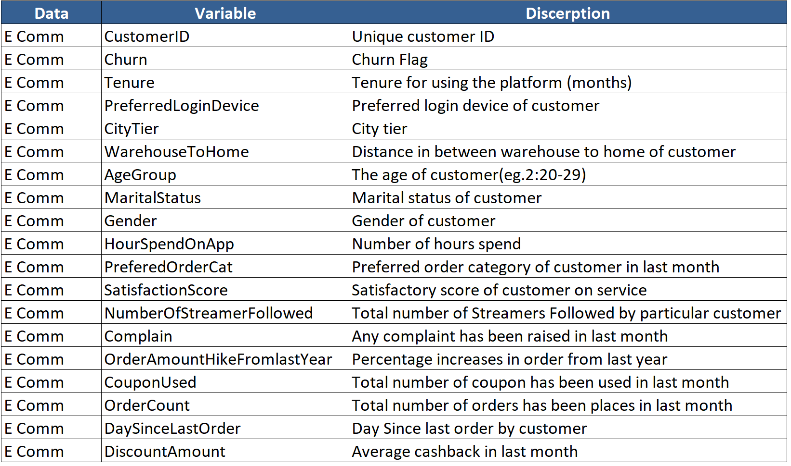
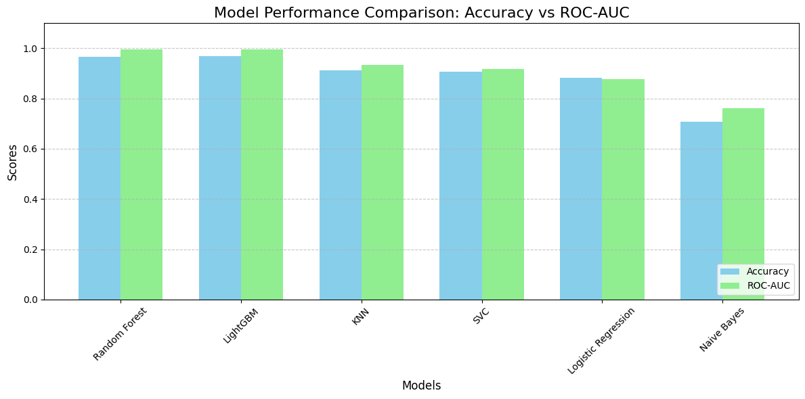
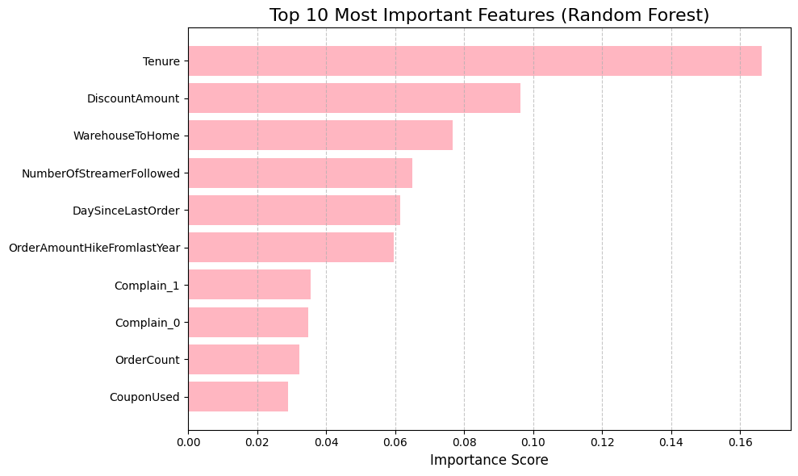
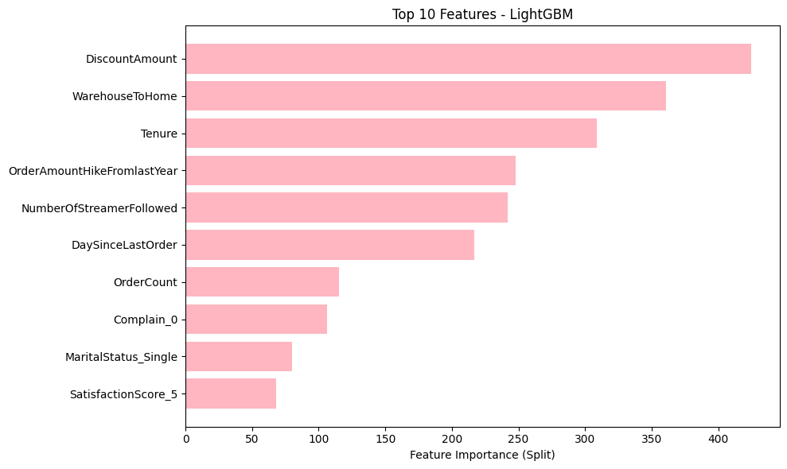
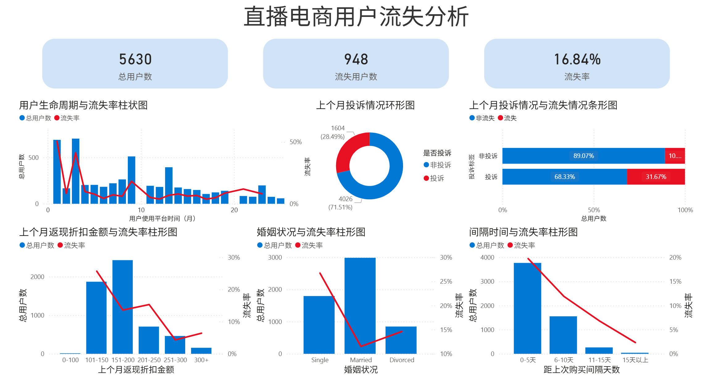
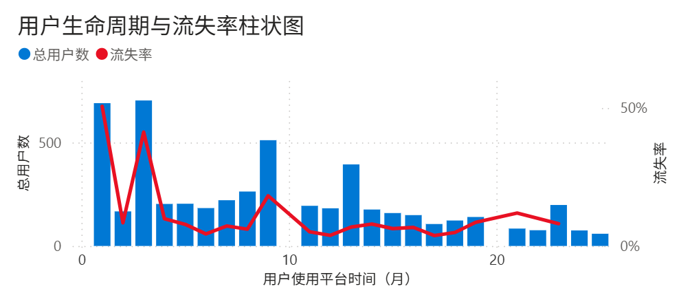
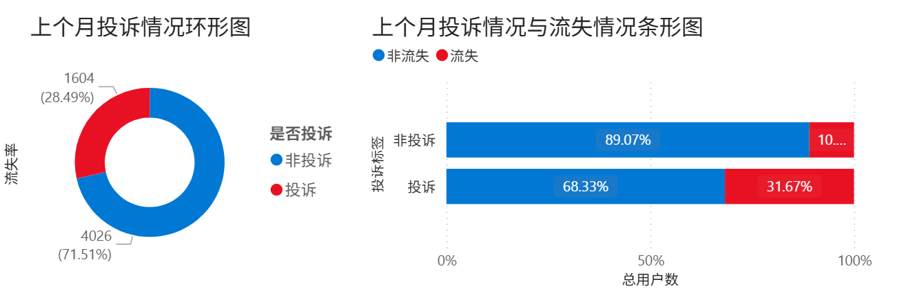
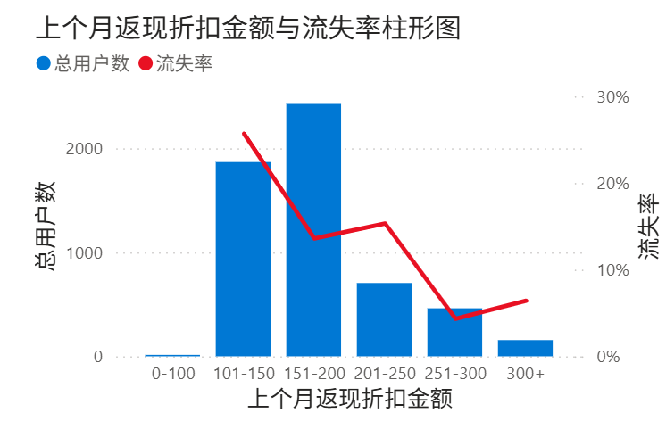
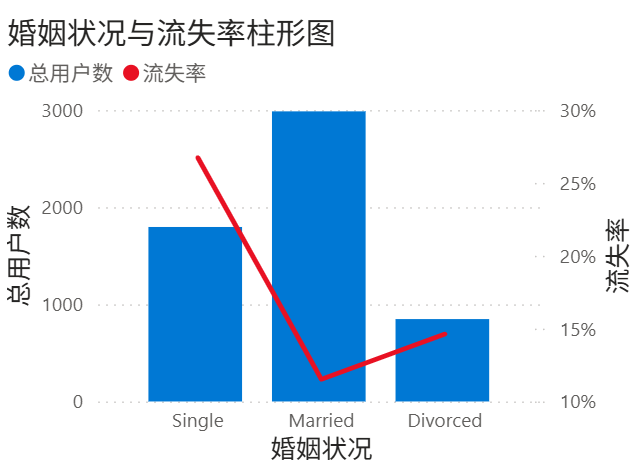
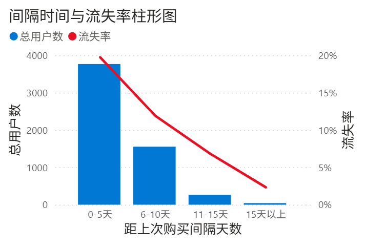

# 直播电商用户流失预测与归因分析

## 1. 问题背景与分析目的(Project Background & Objectives)

### 1.1 业务背景
在直播电商竞争日益激烈的环境下，**获客成本 (CAC)** 远高于 **用户留存成本**。对于平台而言，高流失率不仅意味着直接的收入损失，更意味着品牌资产的流失。
本项目旨在通过分析直播电商数据，构建用户流失预警模型，并深入挖掘流失背后的驱动因素。

### 1.2 分析目标
1.  **流失预测 (Prediction)**：基于用户画像与行为数据，利用机器学习算法精准识别高潜流失风险用户。
2.  **归因分析 (Attribution)**：通过特征重要性分析，找出导致用户流失的关键因子（如：物流体验、服务满意度等）。
3.  **策略落地 (Action)**：结合 PowerBI 仪表板实现数据可视化监控，并提出针对性的用户挽留策略，以提升 **用户生命周期价值 (CLV)**。

## 2. 数据理解与清洗处理(Data Understanding & Preprocessing)

### 2.1 数据概况

- **数据来源**：[Aliyun Tianchi Dataset](https://tianchi.aliyun.com/dataset/124814)

- **数据内容**：包含直播电商用户的流失标签以及用户的多维度信息，涵盖人口统计学特征（`年龄`、`性别`、`城市等级`、`婚姻状况`）、行为特征（`登录设备`、`平台使用时间`、`订单数`等）、物流特征（`仓库距离`）及历史反馈（`投诉`、`满意度`等）等内容。
- **数据字典**：

> **⚠️ 专业思考与数据局限性说明：**
> - 因资源有限，对于该数据集的**数据口径**无法明确。比如 `流失标签Churn`到底怎么样算是“流失”；`年龄组AgeGroup`是按什么分的组；`使用时长HourSpendOnApp`是什么时间范围……
> - 在后面的数据探索阶段我也发现该数据集存在一定的**数据质量问题**。（如`DaySinceLastOrder`和`Churn`的逻辑冲突等）
> - 在真实的业务场景中，我会优先与数据工程团队或业务部门**对齐口径**（例如明确“流失”定义：是7天未登录还是30天未下单？），确保数据**准确性**、严格明确各项数据的含义，确保数据集本身没有问题后再进行后续分析处理。
> - 鉴于本项目为公开的数据集，我基于通用电商逻辑进行了假设性清洗，和后续建模与分析，重点在于**展示分析思路**。

### 2.2 数据清洗与处理 (Excel Operation)
利用 Excel 对原始数据进行了细致的预处理，确保模型输入的质量。

#### 缺失值处理(Missing Values)
|属性|特征|填充方式|
| -- | -- | -- |
|Tenure用户使用平台的时间（月）|数据有明显离群值，呈偏态分布|中位数填充|
|WarehouseToHome 仓库到家的距离|数据有明显离群值|中位数填充|
|HourSpendOnApp 用户使用APP的时间|变量较好地集中在均值周围，均值和中位数相等|中位数/均值填充|
|OrderCount 上个月订单数|考虑数据的空值代表上月无订单，填充为0；但是后面发现一些行OrderCount(上月订单数)缺失但在CouponUsed(上月使用优惠券数量)是有数值的，对于这些用中位数填充OrderCount，其余填充为0 |分类使用中位数和0填充|
|OrderAmountHikeFromlastYear 订单较去年增加|数据呈偏态分布|中位数填充|
|DaySinceLastOrder 距离上次下单天数|数据有明显离群值，呈偏态分布|中位数填充|
|CouponUsed 上个月使用优惠券数量|数据呈偏态分布|中位数填充|

#### 标准化文本标签
- PreferredLoginDevice (偏好登录设备)：将 "Phone" 和 "Mobile Phone" 统一合并，消除指代歧义。

## 3. 机器学习建模 (Machine Learning & Modeling)

### 3.1 模型实验(Python)
我测试了多种算法以寻找最优解：
- **基准模型**：Logistic Regression (逻辑回归)、Naive Bayes (朴素贝叶斯)。
- **非线性模型**：KNN、SVM (支持向量机)。
- **集成模型**：Random Forest (随机森林)、LightGBM。

[模型实验(Python)](模型训练.ipynb)

### 3.2 模型评估
在流失预测场景中，样本是不平衡的（流失用户是少数）。因此，单纯的 `Accuracy` 可能会具有误导性。因此除了关注`Accuracy`外我也要关注 **`ROC-AUC`** 指标

|Model|Accuracy|ROC-AUC|
|--|--|--|
|**Random Forest**|0.967140|**0.996216**|
|**LightGBM**|**0.968917**|0.994799|
|KNN|0.911190|0.934196|
|SVC|0.906750|0.917915|
|Logistic Regression|0.881883|0.877159|
|Naive Bayes|0.708703|0.762298|

**结论**：最终选择 **LightGBM** 和 **Random Forest** 作为核心模型，二者在 ROC-AUC 上均达到了 0.99 以上的优异表现，具备极强的落地价值。

<!-- ### 3.3 特征重要性 (Feature Importance)
基于模型输出的特征重要性排序（Feature Importance Plot）

  -->

## 4. 业务洞察与归因分析
### 4.1 关键流失因子 (Feature Importance)
基于 **LightGBM** 和 **Random Forest** 的特征重要性输出，发现了以下影响流失的核心因素：

 

- **Tenure**：客户使用平台的时长（月）
- **Complain**：上个月是否发起过投诉（1=是，0=否）
- **MaritalStatus**：客户的婚姻情况（包括 已婚、未婚、离异）
- **DaySinceLastOrder**：距上次下单间隔天数
- **DiscountAmount**：上个月的平均返现或折扣金额

以上5项用户特征/指标，对“流失”标签的结果影响最大。

### 4.2 数据可视化看板
为了让业务人员能实时监控流失态势，我搭建了[Power BI交互式仪表板](直播电商用户流失分析数据看板.pbix)：

### 4.3 数据分析与策略建议 (Analysis and Recommendations)
基于上述数据洞察，我将对现状进行分析，并尝试给出业务建议。

> 再次申明：在分析前应该确保数据是准确的。以下分析建立在假设该数据集无误的前提下，主要用于展示分析的思路

#### Tenure：客户使用平台的时长（月）

##### 现状分析
- **流失高峰期在早期（前3个月）**： 数据显示了一个非常明显的“初期高流失”特征。
- 第1个月（新客期）： 流失率达到顶峰（红线最高点），且用户基数（蓝柱）很大。这说明大量用户在注册或首月体验后迅速流失。
- 第3-4个月（磨合期）： 出现了第二个流失小高峰。这通常对应着短期促销结束、试用期结束或用户新鲜感消退的节点。
- **后期趋稳**： 只要用户挺过了前5个月，流失率就会显著下降并保持在低位，说明老客户的忠诚度（粘性）很高。

##### 业务建议
- **优化“首月体验”**： 既然第1个月流失最严重，必须检查新手引导流程。是否有操作太复杂？是否承诺的服务未兑现？等问题。可以设计“新用户首月关怀计划”，通过新手任务奖励、专人客服引导等策略来帮助用户度过适应期。
- **第3个月的“防流失干预”**： 针对第3个月的流失反弹，需要检查业务逻辑。是因为某种季度套餐到期吗？建议在第2个月末推送“续费优惠”或“老客专享权益”，提前锁定用户。
- **分层运营**： 将用户定义为“考察期用户（0-5月）”和“忠诚用户（5月+）”。前者重点在于留存和转化，后者重点在于挖掘更高价值。

#### Complain：上个月是否发起过投诉

##### 现状分析
- **投诉率高**： 整体上约 28.49% 的用户发起了投诉。这是一个比较高的比例，说明产品或服务可能存在普遍性的痛点。
- **投诉导致流失**：
  - 未投诉用户的流失率较低（约10%+）。
  - 投诉用户的流失率很高约 31.67%。这意味着，一旦用户产生不满并发起投诉，流失的概率增加了 3倍。

##### 业务建议
- **降低投诉率**：需要对投诉内容进行文本挖掘，找出“顾客为什么投诉？”是否是一个普遍性的问题，从源头改进产品。
- **投诉后挽回机制**： 投诉者的流失率高，说明目前的客服处理可能未能有效安抚用户。可以考虑赋予一线客服更高的权限（如直接发放小额优惠券），并建立“投诉后回访机制”等，尽可能减少因为投诉导致用户流失的情况。
- **识别“沉默的流失者”**： 关注到在没投诉的用户中也有10%的人流失，需要通过行为数据（如活跃度下降等）提前预警。

#### DiscountAmount：上个月的平均返现或折扣金额

##### 现状分析
- **折扣的“双刃剑”效应**：
    - 低折扣区（0-100）： 用户极少，数据参考性弱。
    - 中等折扣区（101-150）： 流失率最高（>20%）。这可能是一群“对价格敏感但觉得优惠不够”的用户。
    - 高折扣区（151-300）： 随着折扣金额增加，流失率呈现明显的下降趋势。特别是250+区间，流失率极低。
- **主要群体在151-200**： 这是用户最集中的区域，流失率控制在相对较低的水平（约12-13%）。

##### 业务建议
- **利用折扣换留存**： 数据证明，折扣确实能降低流失。对于流失风险高的用户（如前面的单身用户、刚投诉的用户），可以适当增加折扣力度（Target Discount），将他们推向 >150 的折扣区间。
- **警惕“薅羊毛”后的流失**： 101-150区间的高流失率值得警惕。这群人可能拿了优惠还是觉得不够。可以深入分析这个区间的用户画像，是因为优惠门槛太高导致体验不好？还是因为他们本身就是极其挑剔的价格敏感型用户？
- **精细化补贴**： 不要给所有人都发大额券。对于250+区间的用户，流失率已经很低了，继续加大折扣可能是资源浪费。可以将资源倾斜给101-150区间这部分“摇摆用户”，试图将他们的流失率压下来。

#### MaritalStatus：客户的婚姻情况

##### 现状分析
- **单身用户（Single）最不稳定**： 单身用户的流失率最高（约27%），尽管他们的用户基数不是最大的。
- **已婚用户（Married）是基本盘**： 已婚用户不仅人数最多，而且流失率最低（约12%）。这是平台最核心、最稳定的资产。
- 离异用户（Divorced）： 表现中规中矩。

##### 业务建议
- **针对“已婚”用户群体做家庭营销**： 已婚用户极其稳定，可能因为他们有家庭采购需求，对稳定性要求高。建议针对该群体的需求推出“家庭套餐”、“母婴专区”或“批量购买优惠”，进一步巩固这一核心群体的客单价。
- **针对“单身”用户群体做动态营销**： 单身用户可能更追求新鲜感、价格敏感或需求变动快。针对他们，营销文案应强调“个性化”、“小份装”、“快速配送”或“社交属性”，以提高他们的粘性。

#### DaySinceLastOrder：距上次下单间隔天数

##### 现状分析
- 很反直觉的**近期高流失**情况：
  - 0-5天（刚买完）： 用户数最多，但流失率是最高的（接近20%）。
  - 15天以上（很久没买）： 流失率反而极低。
- 猜测： 这可能意味着一种“用完即走”或“糟糕的购后体验”
    - 可能性A： 用户是为了**某个特定短期需求**来的，买完就卸载/取消关注。
    - 可能性B： 用户刚下完单，**体验极差**（如发现买贵了、配送体验差），在收货后的几天内迅速决定不再使用。

##### 业务建议
- **抓住“购后黄金期”**： 用户下单后的0-5天是极其敏感的时期。建议在物流详情页、支付成功页增加互动（如小游戏、积分领取），保持用户活跃。
- **分析“一次性用户”特征**： 深入分析这部分0-5天就流失的用户买了什么？如果是某些特定品类（如耐用品），属于正常现象；如果是高频消费品，则说明平台未能留住他们。
- **召回策略前置**： 既然15天以上流失率低（可能是留下的都是死忠粉，或者沉默用户未被定义为流失），重点应放在如何让0-5天的用户产生“第二次购买意愿”。例如：在包裹中附带“下次购买立减券”。

### 4.4 业务建议汇总
- **全生命周期分层运营**：界定“考察期（0-5月）”与“忠诚期（5月+）”用户，前者聚焦**留存转化**，后者侧重全生命周期价值（LTV）挖掘。
- **客诉溯源与体验治理**：深度复盘投诉根因，建立问题反馈闭环，从业务源头**降低客诉率**并优化服务体验。
- **精细化补贴模型**：动态调优返现折扣力度，平衡成本与激励效果，规避资源浪费或激励不足，实现ROI（投入产出比）最大化。
- **差异化人群营销**：基于“已婚/单身”等核心标签构建细分场景，定制专属权益与触达策略，实现精准营销。
- **购后黄金期促活**：锁定下单后0-5天黄金活跃窗口期，部署自动化触达策略，强化用户互动与复购心智。

## 5. 思考与总结

这是我第一个独立完成的数据分析项目，此前没有过数据分析的工作经验，所以想自己“创造”一个项目作为找到第一份数据分析实习的敲门砖，由于数据来源有限、也没有其他部门的协调交流，颇有一种“没有条件，创造条件”的艰苦感觉。

整个项目就是，我在阿里天池上找了一份较为贴近业务的数据集，对其分析，尽可能融合展现我的所有技能：Excel，机器学习，Python，PowerBI，还有业务思维。也在努力将项目不要弄成“为了用某个工具而用某个工具”，而是努力站在专业的数据分析师视角，去剖析数据、分析数据、结合实际业务提出策略建议。

在整个项目的过程中我也有很多收获和成长，不仅仅是技术，更是分析思维和业务逻辑。我更加坚定了想要向数据岗位发展的职业规划，期待着能顺利找到一份实习工作，能让我真正进入业务环境，去在“为什么”中得到思考与成长。